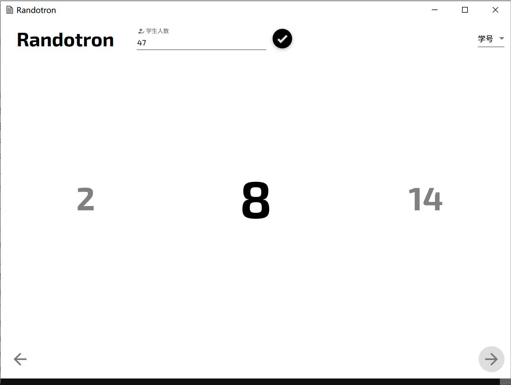

# Randotron

## Info
Built with WPF and some extensions for material designing.

With terrible codes.
## Name inspiration
This project's name is from the famous TV series Rick and Morty.

And I think this is a great name for your project, so if you want to name yout repository with it, feel free to contact with me and I will change my repository's name.
## Feature
- Generate random student's number each time with equal possibility.
- Still developing.
## Known Bugs
- If you don't type in the number of students and just press  `Enter`, then the program will show sorted numbers from `1` to `1000`.
- Only supports Chinese.
## 命名灵感
灵感来源于瑞克和莫蒂 `S4E3`。由于我认为自己的代码配不上这么优秀的名字，因此如果你想将自己的仓库命名为 `Randotron`，请联系我。
## 特点
- 等概率地生成学生学号。
- 更新中。
## 已知问题
- 如果错误地操作导致没有输入学生数量就点按了 `Enter`, 那么程序会依次输出 `1` 到 `1000` 的数字。